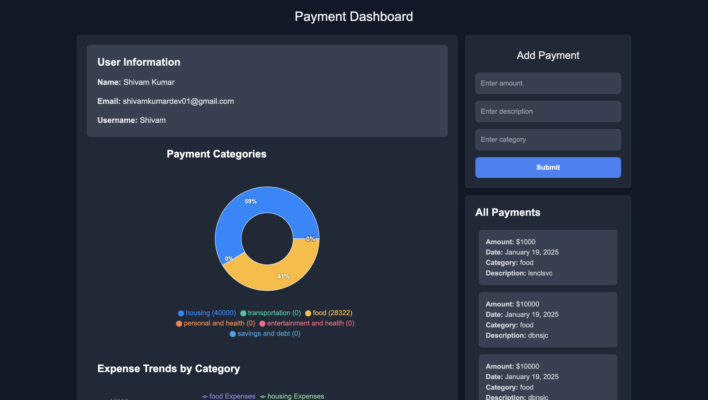

# Expense Tracker 💰

An efficient and user-friendly **Expense Tracker** application built with **Next.js** and integrated with **Chart.js** for visualizing your financial data. Track your expenses, manage categories, and gain insights into your spending habits!

---

## 🚀 Features

- **Add, Edit, and Delete Expenses**: Stay on top of your finances by managing your transactions easily.
- **Categorized Tracking**: Organize expenses into categories like Food, Travel, Utilities, and more.
- **Visual Insights with Chart.js**: Get a clear picture of your spending trends with beautiful charts.
- **Responsive Design**: Access your expense tracker on any device, anywhere.
- **Secure and Scalable**: Built with modern tools to ensure smooth performance and data security.

---

## 🛠️ Tech Stack

- **Frontend**: [Next.js](https://nextjs.org/) (React Framework)
- **Charts**: [Chart.js](https://www.chartjs.org/) (Data Visualization)
- **Database**: MongoDB (Flexible and Scalable NoSQL Database)
- **Backend**: Node.js and Express.js
- **Styling**: Tailwind CSS for a sleek and modern design

---

## 🛠️ Installation

1. Clone the repository:

```bash
git clone https://github.com/yourusername/expense-tracker.git
```

2. Navigate to the project directory:

```bash
cd expense-tracker
```

3. Install dependencies:

```bash
npm install
```

4. Set up environment variables: Create a .env file in the root directory and add the following:

```bash
MONGODB_URI=<your-mongodb-uri>
NEXTAUTH_SECRET=<your-next-auth-secret>
```

5. Run the development server:

```bash
npm run dev
```

## 🧑‍💻 Contributing

We welcome contributions to improve the app! If you'd like to contribute, please follow the steps below:

### 1. Fork the Repository

Click the **Fork** button at the top right of the repository page to create your own copy of this project.

### 2. Clone the Repository

Clone your forked repository to your local machine:

```bash
git clone https://github.com/yourusername/expense-tracker.git

# Navigate to the project directory:

cd expense-tracker
```

3. Create a New Branch

- Create a new branch for your feature or bug fix:

```bash
git checkout -b feature-name
```

4. Make Your Changes
   Make the necessary changes to the code. Ensure that your changes are well-documented and follow the existing code style.

5. Commit Your Changes

- Once you're happy with your changes, commit them with a descriptive message:

```bash
git add .
git commit -m "Add new feature or fix bug"
```

6. Push to Your Fork

- Push your changes to your forked repository:

```bash
git push origin feature-name
```

7. Open a Pull Request

- Go to the original repository and create a pull request with a description of your changes.

8. Code Review

- Your pull request will be reviewed by the project maintainers. They may request changes or provide feedback. Make sure to address any comments before the changes are merged.
